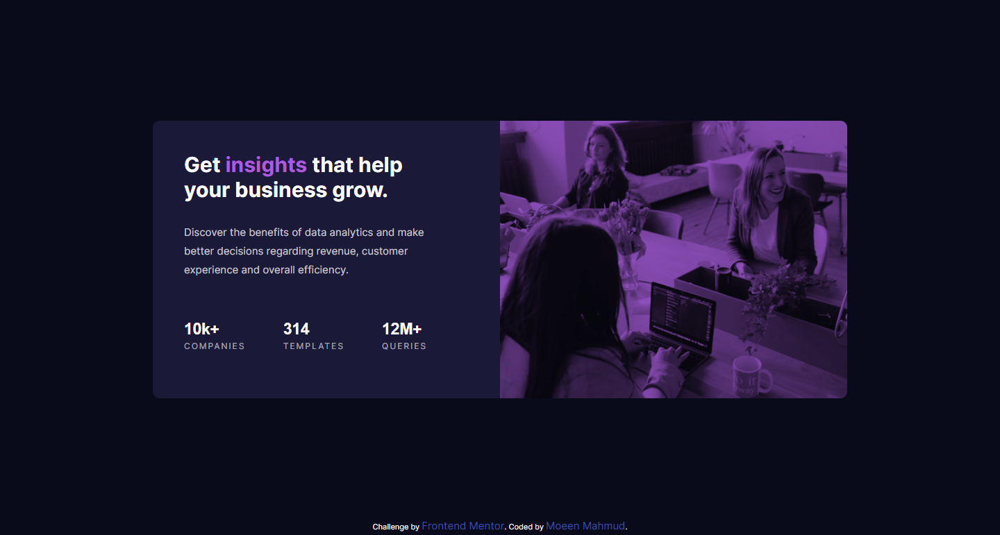

# Frontend Mentor - Stats preview card component solution

This is a solution to the [Stats preview card component challenge on Frontend Mentor](https://www.frontendmentor.io/challenges/stats-preview-card-component-8JqbgoU62)

## Table of contents

- [Overview](#overview)
  - [The challenge](#the-challenge)
  - [Screenshot](#screenshot)
  - [Links](#links)
- [My process](#my-process)
  - [Built with](#built-with)
  - [What I learned](#what-i-learned)
  - [Continued development](#continued-development)
  - [Useful resources](#useful-resources)
- [Author](#author)
- [Acknowledgments](#acknowledgments)

## Overview

### The challenge

Users should be able to view the optimal layout depending on their device's screen size

### Screenshot



### Links

- Solution URL: [GitRepo](https://github.com/moeen-mahmud/stats-preview-card-component)
- Live Site URL: [LiveSite](https://moeen-stats-preview-card-component.netlify.app/)

## My Process

### Built With

- Semantic HTML5 markup
- CSS custom properties
- Flexbox
- Mobile-first workflow
- [GoogleFonts](https://fonts.google.com/) - For font styles

### What I learned

I learned how to use css custom properties and how to add blend mode in css background image.

```
.image {
  background-color: var(--accent-color);
  background-image: url(./images/image-header-desktop.jpg);
  width: 500px;
  height: 400px;
  background-size: cover;
  border-radius: 0 10px 10px 0;
  background-blend-mode: multiply;
  filter: opacity(0.8);
}
```

### Continued Development

I will try to solve more and more **Fronendmentor** challenges for developing my HTML, CSS and JavaScript. This is my first project after a long web development learning _pause_.

### Useful resources

- [WesBos](https://flexbox.io/) - This is a great course for learning flexbox. I really liked the way he teaches, helped me a lot.

- [MDN](https://developer.mozilla.org/en-US/) - A Bible for any web developers.

## Author

- Frontend Mentor - [fahim-mahmud](https://www.frontendmentor.io/profile/fahim-mahmud)
- Twitter - [moeen_mahmud](https://twitter.com/moeen_mahmud)
